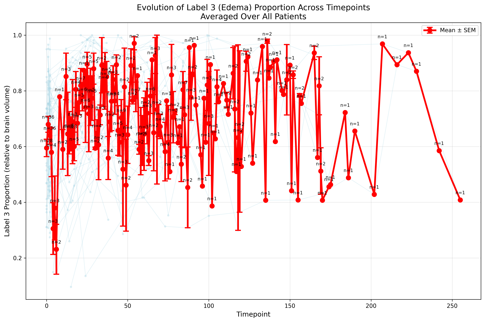
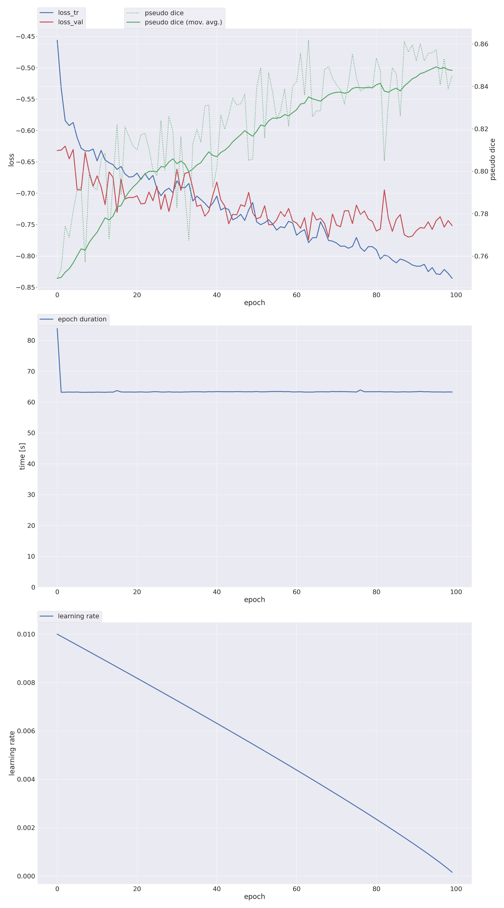

# 🧠 Edema Segmentation using nnU-Net with Transferability to ARIA-E Monitoring

## Introduction

This project provides a **3D U-Net based segmentation model** for edema detection in FLAIR sequences using the **nnU-Net framework** trained on the LUMIERE dataset. The model is specifically designed with transferability to **ARIA-E (Amyloid-Related Imaging Abnormalities - Edema)** monitoring in mind, making it valuable for clinical applications in Alzheimer's disease treatment monitoring.

### 🎯 Key Applications:
- **Edema segmentation** in FLAIR MRI sequences
- **ARIA-E monitoring** for patients on amyloid-targeting therapies
- **Longitudinal analysis** across multiple timepoints
- **Automated report generation** with quantitative metrics

---

### 📊 Model Performance

- **Final Dice Score**: 0.85
- **Training Dataset**: 110 volumes
- **Validation Dataset**: 28 volumes
- **Architecture**: 3D U-Net (full resolution)
- **Training Duration**: 100 epochs

---

### 🗂️ Project Structure

```plaintext
📦 Project Root
│
├── nnunet_raw/
│   └── Dataset001_LUMIERE/
│       ├── imagesTr/              Training images (e.g., LUMIERE_001_0000.nii.gz)
│       ├── labelsTr/              Training labels (e.g., LUMIERE_001.nii.gz)
│       ├── imagesTs/              Test images
│       ├── labelsTs/              Test labels
│       └── dataset.json           Dataset configuration
│
├── nnUNet_preprocessed/           Preprocessed data
├── nnUNet_trained_models/         Model weights and checkpoints
├── analyze.py                     Dataset analysis script
├── dataset_to_nnunet.py          Data preparation script
├── quantitative_analysis.py       Single timepoint analysis
├── longitudinal_analysis.py       Multi-timepoint comparison
├── generate_report.py             HTML report generation
└── README.md                      This README file
```

---

## 🚀 Setup and Installation

### **Step 1 — Environment Setup**
```bash
# Create and activate conda environment with Python 3.10
conda create -n nnunet python=3.10 -y
conda activate nnunet

# Install PyTorch with CUDA 11.8 support
conda install pytorch torchvision torchaudio pytorch-cuda=11.8 -c pytorch -c nvidia -y

# Clone nnU-Net repository and install
conda install git -y
git clone https://github.com/MIC-DKFZ/nnUNet.git
cd nnUNet
pip install -e .

# Optional: Install hiddenlayer for visualization
pip install --upgrade git+https://github.com/FabianIsensee/hiddenlayer.git
```

### **Step 2 — Environment Variables**
Add the following to your `~/.bashrc`:
```bash
export nnUNet_raw="/path/to/your/nnunet_raw_data_base"
export nnUNet_preprocessed="/path/to/your/nnunet_preprocessed"
export nnUNet_result="/path/to/your/nnunet_trained_models"
source ~/.bashrc
```

### **Step 3 — Dataset Preparation**
```bash
# Download LUMIERE dataset
kaggle datasets download rodschermitg/lumiere-dataset

# Convert and prepare dataset for nnU-Net format
python dataset_to_nnunet.py
```

---

## 🛠️ Training

### **Custom Trainer Implementation**
For efficient training within hackathon constraints, we implemented a custom trainer for 100 epochs:

```python
from nnunetv2.training.nnUNetTrainer.nnUNetTrainer import nnUNetTrainer

class nnUNetTrainer_Custom100Epochs(nnUNetTrainer):
    def __init__(self, *args, **kwargs):
        super().__init__(*args, **kwargs)
        self.max_num_epochs = 100
```

### **Training Commands**

**1. Experiment Planning and Preprocessing:**
```bash
nnUNetv2_plan_and_preprocess -d 001 --verify_dataset_integrity
```

**2. Model Training:**
```bash
nnUNetv2_train 001 3d_fullres 0 --npz -tr nnUNetTrainerCustom
```

### **Hardware Requirements**
- **GPU**: NVIDIA RTX8000 (48GB) or equivalent
- **Training Time**: Approximately 100 epochs
- **Memory**: High GPU memory required for 3D full-resolution training

---

## 📈 Data Preprocessing

The preprocessing pipeline includes:
- **Timepoint Selection**: First 2 timepoints per case (high edema content)
- **Registration**: Data pre-registered between timepoints
- **Resolution**: Already set to 1x1x1 mm
- **Normalization**: Scaling to [0,1] range
- **Label Processing**: Keep only edema labels (label 3 → label 1)
- **Format**: Convert to nnU-Net standard format

### **Edema Distribution Analysis**
Initial analysis of edema distribution across timepoints showed no clear temporal trend, confirming our decision to use the first 2 timepoints for each case:


*Distribution of edema volumes across different timepoints showing no significant temporal pattern*

---

## 🔬 Analysis and Reporting

### **Quantitative Analysis**
```bash
# Single timepoint analysis
python quantitative_analysis.py path_to_mask
# Returns: dictionary with volume metrics and lesion characteristics
```

### **Longitudinal Analysis**
```bash
# Multi-timepoint comparison
python longitudinal_analysis.py
# Input: dictionaries from timepoint1 and timepoint2
# Output: longitudinal findings dictionary
```

### **Report Generation**
```bash
# Generate HTML report
python generate_report.py
# Input: longitudinal findings dictionary
# Output: Comprehensive HTML report with visualizations
```

---

## 📋 Key Features

- **Automated Edema Detection**: High-precision segmentation of edema regions in FLAIR sequences
- **Clinical Transferability**: Designed for ARIA-E monitoring applications
- **Quantitative Metrics**: Volume measurements and lesion characterization
- **Longitudinal Tracking**: Evolution analysis across multiple timepoints
- **Professional Reporting**: HTML-based reports for clinical use
- **Efficient Training**: Custom trainer for rapid model development

---

## 📊 Results

The model achieved strong performance with a **Dice score of 0.85**, demonstrating reliable edema segmentation capabilities. The training progression shows consistent convergence over 100 epochs.


*Training and validation loss curves showing model convergence over 100 epochs*

---

## 🏆 Hackathon Context

This project was developed as part of the **Gemma Hackathon by Google DeepMind**, Paris, July 5th, 2025.

**Team Members:**
- Rohitkumar Datchanamourty
- Mateo Zoughebi

---

## 📄 License
MIT License

---

## 🙏 Acknowledgements
- **nnU-Net Framework** by MIC-DKFZ for the robust segmentation architecture
- **LUMIERE Dataset** for providing comprehensive training data
- **Google DeepMind** for hosting the Gemma Hackathon
- **Kaggle** for dataset hosting and accessibility

---

## 📧 Contact
For questions or collaboration opportunities, please reach out to the development team through the hackathon organizers.
